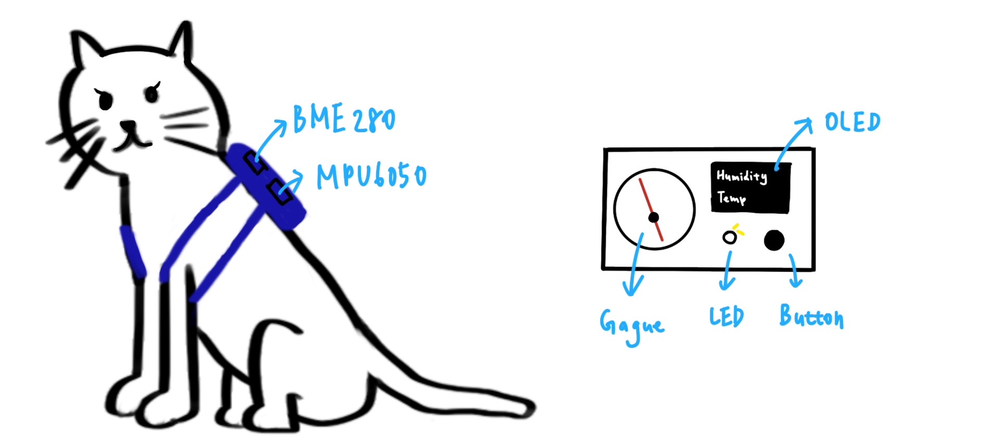
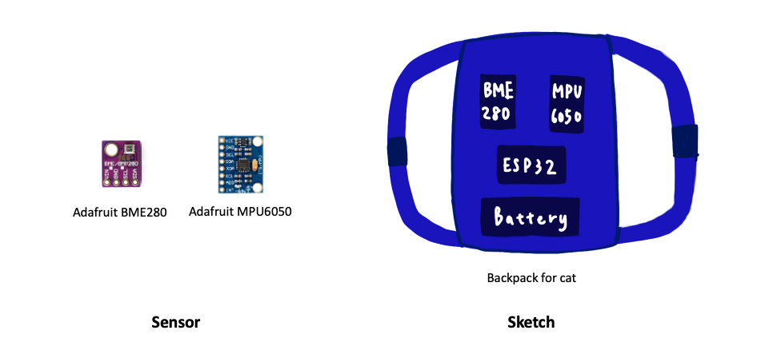
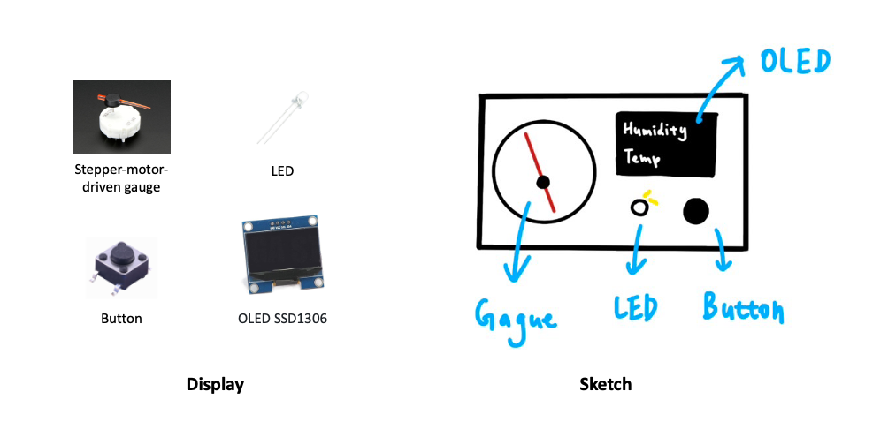
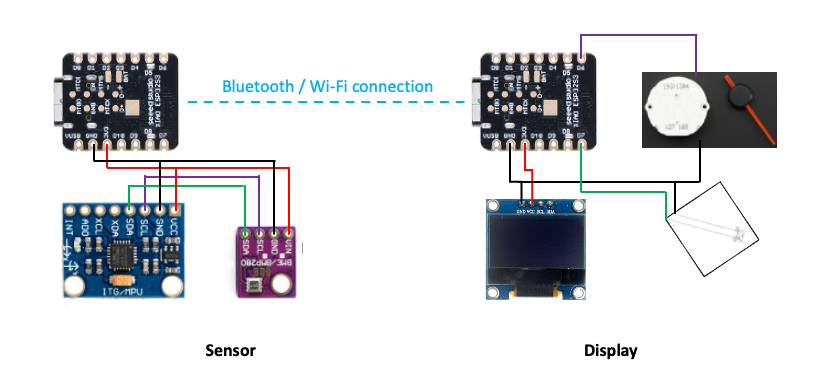

# Purrfect: Cat motion and humidity sensor
This system is designed to maintain an optimal environment for your cat, with a focus on keeping humidity and temperature at ideal levels. The default settings are 50% humidity and 26°C. However, when the cat is active, the system adjusts to 45% humidity and 24°C. Additionally, this device offers a pet location tracking feature.

## Sensor
This wearable module includes a battery, a humidity sensor, a motion sensor, and an MPU (Micro Processing Unit). Key components include:
- Seeduino XIAO ESP32S3
- Adafruit BME280: humidity and temperature sensor
- Adafruit MPU6050: motion sensor

## Display
The display unit features a battery, a processor, an OLED screen, a gauge, and a button, all integrated onto a custom PCB. This interface allows pet owners to monitor their cat's conditions and adjust the environment accordingly. It's a user-friendly system designed to keep your pet comfortable and healthy.
- stepper-motor-driven gauge: indicates the current humidity level
- LED: light when the device is on
- Button: to open device
- SSD1306 OLED: display readings

## Architecture

