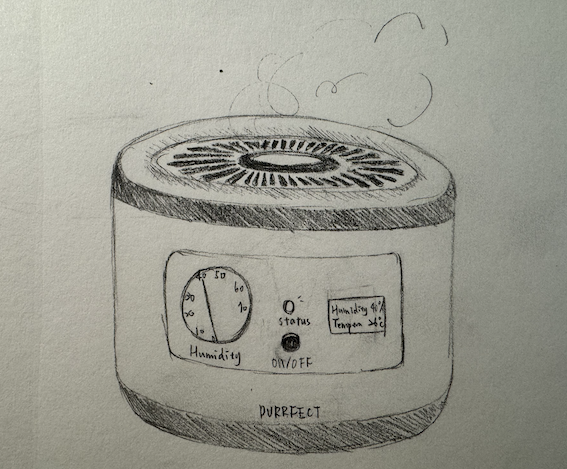
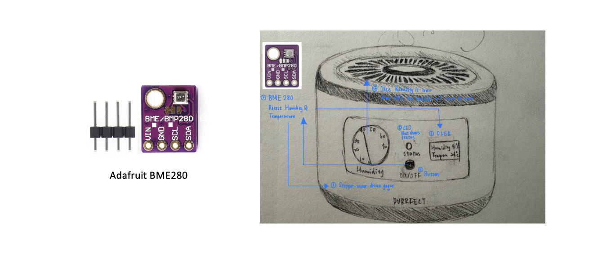
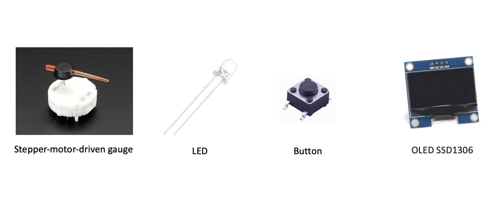
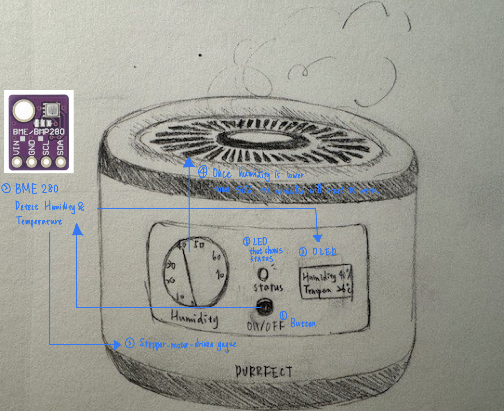

# Purrfect Climate - the Smart Humidifier for Cats
## Introduction
"Purrfect Climate," the ultimate smart humidifier crafted for your cat's health. Maintaining ideal humidity at 50% and temperature at 26°C, it ensures your pet's comfort through advanced sensors and a user-friendly display. Elegant, safe, and energy-efficient, "Purrfect Climate" is where innovation meets feline care.
Upon activating the power button, the sensor gauges the current humidity level and begins to emit mist until the preferred humidity is achieved.
 

## Processor
- Microcontroller: Seeduino XIAO ESP32S3

## Sensor
- Sensors: Equipped with Adafruit BME280 (humidity and temperature sensor) to constantly monitor the environment.

## Display
- Gauge: A stepper-motor-driven gauge that indicates the current humidity level with a simple, cat-friendly iconography showing if the humidity is at an optimal level.
- LED Indicator: An LED that changes color based on the temperature reading (blue for cool, red for warm, green for optimal).
- Button: A single, large, capacitive button that is touch-sensitive for easy operation, allowing the owner to switch the humidifier on/off and adjust settings.
- OLED: SSD1306 OLED

## How devices communicate
- Wireless Communication: Utilizes Wi-Fi to transmit data to the display device.
- Power Solution: Rechargeable battery-powered with a low-power design for longevity, and an option for a wall plug for continuous operation.

